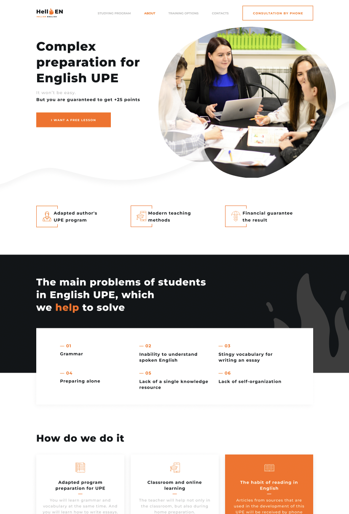

# Team project "Hellish English"

completed after finished the HTML+CSS Module course Full Stack Developer
Bootcamp 23 Online by GoIt

##

[Figma](https://www.figma.com/file/FNysc9PLjxJA9IeWBXlEIU/Hellish-English?node-id=0%3A1)



[Task List](https://):

```
1. Background display (phone, tablet, desktop)
2. Logo display (phone, tablet, desktop)
3. Displaying the title (phone, tablet, desktop)
4. Layout and styles of the card container (phone, tablet, desktop)
5. Markup of the search bar
6. Search string logic by event name
7. Marking of the country selection line
8. Dropdown logic with country selection (to start, see information about which countries the API returns)
9. The logic of loading and displaying events by name
10. Animation of displaying events during the first visit to the main page
11. Layout and styles of one event card
12. The logic of loading events when the page is first loaded
13. Markup and pagination styles
14. Pagination logic, switching pages
15. Animation of the movement of the selected page in pagination
16. Markup and footer styles
17. Modal appearance animation
18. Markup and modal styles of a specific event
19. Darkening and blurring of the background when the modal is open
20. The logic of loading and displaying event data in open mode
21. Placement of event links in ticket purchase buttons
22. The logic of loading and displaying events after clicking the "More from this author" button
23. The logic of closing the modal when clicking on the cross and beyond it
```

Technologies used to implement the project:

- vs code
- git
- npm
- parcel
- HTML 5
- SASS
- CSS grid
- JS

Project implemented:

- all items according to:
  [TASK LIST](https://docs.google.com/spreadsheets/d/19zS365fIf0gNfE8-Q-ruMeYiI7GVlrtNLl45MvLXDPs/edit#gid=0)

- additionally:
  - customize scroll
  - loader
  - smooth scroll to the top
  - dark/light theme toggle

## Development team:

[Katherine Dudar](https://github.com/Katherineeeeeeee) (Team-Lead)

Problems section

- A section contains a header.
- The background of the section should be made with a gradient (black from
  above, white from below).
- The section contains the background image, save it in svg format.
- Make the list of problems as a grid of elements. Use css counters to number
  list items.

How we do it

- The section contains a header and a grid of cards.
- Each card contains a heading. Decorative underlining of headings should be
  performed with a pseudo-element.
- The icons on the cards are implemented using svg sprite.

Benefits section

- The section contains a title and a list of benefits.
- The list of benefits follows the same pattern as a similar list for the
  Problems section.

About section

- A section contains a title, a content image, and a description block.
- In the block with the description, the teacher's name can be called the title.
- Make list icons with pseudo-elements. Save icon image in svg format.
- The text description is added in paragraphs.
- The link at the end of the block can open a modal window with an image of the
  certificate or lead to a resource that explains the importance of this
  certificate.

Guarantee section

- The section contains the title and list of guarantees.
- Marker icons should be saved in svg format and implemented as pseudo-elements.
- Decorative lines should be executed as border list items.

[Andrii Klochko](https://github.com/oLORDer) (Scrum Master)

- Create a project repository
- Create a dev branch
- Set protection for the master and dev branches, preventing other team members
  from making changes
- Create fragment files for components
- Create a project structure
- Export the color palette to a variable
- Add styles for public classes
- Add basic styles
- Save the icons and create a sprite.svg
- Advanteges section
- How we do section

[Denys Dashkevych](https://github.com/MajorPrestige) (Full Stack Dev)

Hero section

- "Comprehensive preparation for external examinations in English" is the title
  of the page.
- The "I want to take a free class" button is an anchor link to the section with
  the form.
- Save the main background image in png format. Images can be inserted as
  content if you plan to add an animated image.

Header section

- In the header of the site there is a logo, a navigation menu and a button
  "Consultation by phone".
- On mobile and tablet versions, the navigation menu is displayed as a pop-up
  element. The appearance animation is arbitrary. The mobile menu is fixed,
  width and height cover the entire screen area (viewport).
- The menu is implemented with anchor links that lead to the relevant sections
  of the layout.
- The "By phone" button opens a modal window with an order form. Since the
  design of the modal window is not on the layout, this is not a mandatory task.

[Vyacheslav Ushakov](https://github.com/zerkel1991) (Full Stack Dev)

- A section contains a header and a three-level list.
- Decorative marking of the list should be performed with pseudo-elements.
- Add a decorative image as a pseudo-element.

Contacts section

- In the contacts section there is a header and a feedback form.
- The form needs to add minimal input validation. For this, you can use the
  pattern attribute.
- If invalid data was entered, the field should be highlighted in red.
  Validation should not be highlighted until the user has entered data.

Footer section

- In the footer there is a logo, contact phone number and links to social
  networks.
- The phone number must be implemented using communication protocols.
- Embed social network icons as background, gradient is not rendered via svg
  sprite. Links to external sources should open in a new tab.

[Sergii Gulaga](https://github.com/Ry6ens) (Full Stack Dev)

- The section includes a header and a feedback slider.
- The review is an independent work of the author and can be published
  separately from other page content. According to the specifications, feedback
  (comment) is highlighted with the article tag.
- Each slide has a photo, a link to a social network and a block with a
  description of the review. The text of the recall is partially hidden, the
  full display of the text can be seen by clicking on the "Read more" link.
- At the bottom of the text is the pagination (link to the recall slide).
  Pagination layout should be done only if you do not plan to connect the slider
  library. When connecting a slider, pagination is inserted automatically, you
  only need to stylize their appearance according to the layout.
- In a more complex version of implementation, pagination is a related (second)
  slider.
- Connection of the slider and everything related to the use of JavaScript is
  optional.
